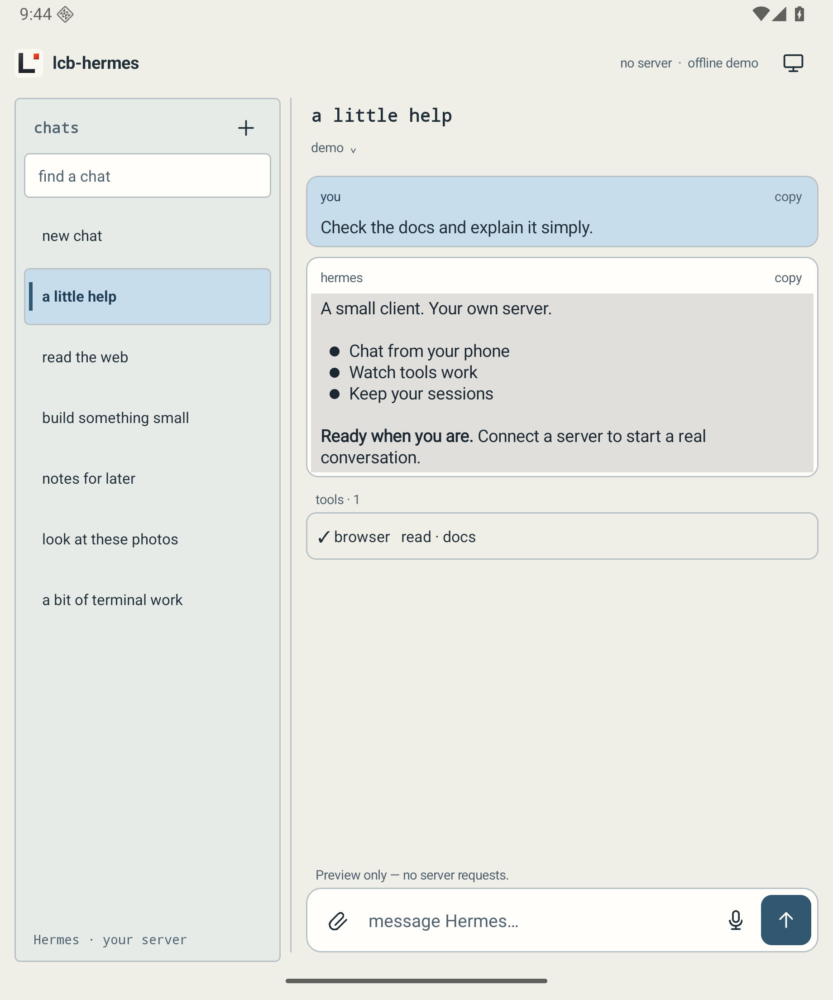

# lcb-hermes

Small native clients for Hermes. No ads. No purchases.

- **Desktop [0.50-pre1](https://github.com/larkingroup/lcb-hermes/releases/tag/v0.50-pre1)** — C / Win32, Windows 10+ x64. One portable EXE.
- **Android [0.4.7](https://github.com/larkingroup/lcb-hermes/releases/tag/v0.4.7)** — native Java, Android 8+.

Connect to your Hermes server with its URL and login. Models and tools stay on
the server. Chats, separate drafts, attachments, model choices, and Hermes activity
sit in a classic beige workbench.

Desktop adds tray notifications and native server settings for provider accounts,
API keys, and custom endpoints. A running Hermes server is required.

**Desktop · 0.50-pre1**

**Android · 0.4.7**

Screenshots use example conversations. [Desktop details](desktop/) ·
[Android details](android/) · [Downloads](https://github.com/larkingroup/lcb-hermes/releases)

Hermes Agent is made by [Nous Research and the Hermes team](https://github.com/NousResearch/hermes-agent).
lcb-hermes is an independent client. Tested against Hermes 0.21.5.
