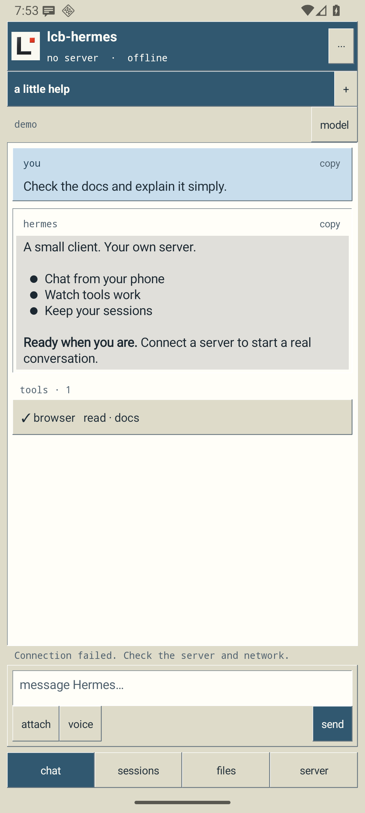

# lcb-hermes

A small native Android client for Hermes. No ads. No purchases.

Connect with the Hermes dashboard URL and dashboard login. Models stay on the server.
Private HTTP needs the checkbox; the client can find the right protocol. No ports to add.

Chat, sessions, files, tools, approvals, voice input, export. Light or dark.

Build: `gradlew assembleDebug` with an Android SDK and JDK 17+.
Windows setup: `python scripts/bootstrap-toolchain.py`, then `scripts/build.ps1`.
Android 8+; targets Android 16. Tested against Hermes 0.21.5.
Keep `.signing` private and backed up: it owns app updates.
