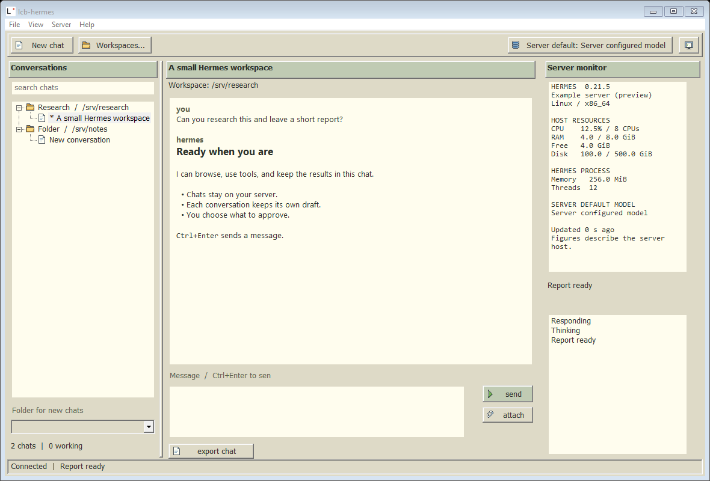

# pc

Native C / Win32. Windows 10+ x64. One portable EXE.

An experimental small C / Xt / Athena client is also available for Linux, with
the same beige palette. [Linux build, scope, and Wine fallback](../linux/README.md).
Classic controls and embedded icons adapted from [lcb-ai](https://github.com/larkingroup/lcb-ai).



The server manager opens on first launch. Add a name and your configured Hermes URL,
such as `https://server:port`, and login. Check private HTTP if your server uses it.
The computer button switches saved servers. Use Server > Server manager to add or
remove a server. Each server/login keeps its own drafts and workspace selection.

Classic beige interface, separate drafts, model selection and Hermes requests.
Images and files sit in a removable attachment tray above the message box.
Sent files leave a compact filename in the transcript. Export is under Chat > Export chat.
Drag the dotted divider to resize the chat list, or use View > Wider/Narrower chat list.
Chats show their saved creation time and source. Completed background replies move
to the top of their folder and turn blue until opened. Folders keep their state during replies.
The right pane shows resource bars and a
wrapped activity log from Hermes events.
Ctrl+Enter sends; Ctrl+N starts a chat; Ctrl+R reconnects.

Workspaces registers existing folders on the server. Choose a folder for new chats;
resumed chats keep their own working directory. Use server paths, such as
`/srv/projects/research`. Older servers can still chat without the projects API.
The default model comes from server configuration. Click the model button to search
configured providers and choose a model and reasoning effort for the current chat.
OpenAI/Codex choices follow Hermes's supported effort ladder. Changes during a turn
apply on the next turn; new drafts carry their choices in `session.create`.

Chats contains conversations in the default server folder and those without a
saved folder. Scheduled runs contains cron conversations. Other registered folders
use their project name; hover a chat to see its server path. Opening a chat never
moves its saved workspace. The default folder is on the server, not this PC.

View > Minimize to tray keeps the connection open. Click the tray icon to return;
right-click for Open or Exit. Closing the window exits. Reply and cron notifications
can be toggled in View. Cron status is checked every 30 seconds while connected;
the first check establishes a baseline. Click a cron notification to show Scheduled
runs in the native sidebar.

Server > Default model on server saves the default for new sessions. The toolbar
model button still changes only the current chat. Server > Settings and providers
opens native controls for API keys, supported OAuth sign-ins, custom endpoints,
the default server folder and automatic title upgrades. Provider sign-in opens its
HTTPS consent page on this PC; tokens stay on Hermes. Providers marked external
still require the server command shown in the panel.

Update support comes from Hermes. Container-managed installations must be updated
through their container host; the panel reports this and disables in-app updating.
The resource monitor shows only the server and its resource readings.

[Native server settings preview](../branding/pc-settings.png).

Settings and login cookies use Windows DPAPI at
`%LOCALAPPDATA%\LCB\hermes\private.bin`. Passwords are not saved.
Closing the client leaves server tasks running.

About credits Nous Research and the Hermes team, with their embedded logo.
[Protocol and upstream references](docs/hermes-protocol.md).

Build with CMake, a C17 compiler and the Windows SDK:

```
cmake -S desktop -B desktop/build
cmake --build desktop/build --config Release
```

`desktop/scripts/build.ps1` runs these steps. Package with
`python desktop/scripts/package.py --binary desktop/build/Release/lcb-hermes.exe`.

For the native contract checks, configure with `-DLCB_BUILD_TESTS=ON`, build, then
run `ctest --test-dir desktop/build -C Release --output-on-failure`.
