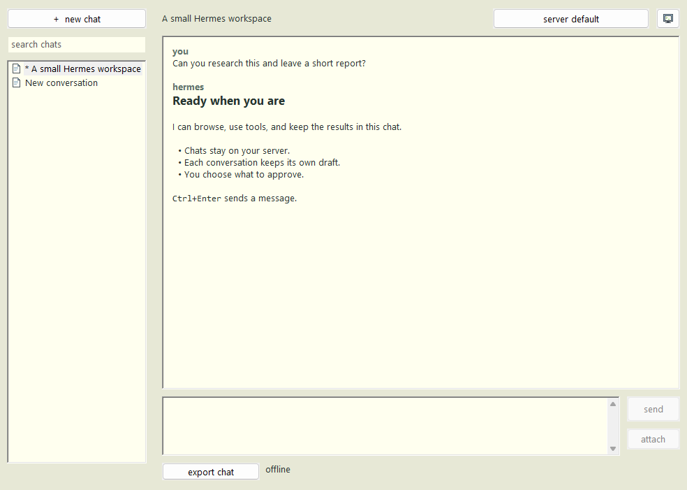

# pc

Native C / Win32. Interface pieces from [lcb-ai](https://github.com/larkingroup/lcb-ai).
Windows 10+ x64. One portable EXE; no local model runtime.



Open the computer button and enter your Hermes URL and login.
Check private HTTP if your private server uses it. First install starts empty.
Works with the headless Hermes API on port 7777; no web page is needed.

Chats, separate drafts, images, model selection, requests, stats, export, light/dark.
Ctrl+Enter sends; Ctrl+N opens a chat; Ctrl+R reconnects.
Right-click the sidebar for refresh and delete. Closing the app leaves server tasks running.

Local settings and login cookies use Windows DPAPI at
`%LOCALAPPDATA%\LCB\hermes\private.bin`. Passwords are not saved.

Build with CMake, a C17 compiler and the Windows SDK:

```
cmake -S desktop -B desktop/build
cmake --build desktop/build --config Release
ctest --test-dir desktop/build -C Release --output-on-failure
```

`desktop/scripts/build.ps1` runs these steps. Package with
`python desktop/scripts/package.py --binary desktop/build/Release/lcb-hermes.exe`.
